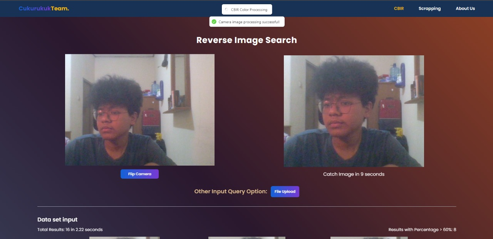

# Content-Based Image Retrieval (CBIR) Application

<p align="center">
  <a href="https://algeo02-22027.vercel.app">
    
    <h3 align="center">CBIR Explorer</h3>
  </a>
</p>

<p align="center">Next.js boilerplate that uses <a href="https://fastapi.tiangolo.com/">FastAPI</a> as the API backend.</p>

<br/>

## Introduction

Welcome to the Content-Based Image Retrieval (CBIR) application! This project combines the power of Next.js for the frontend and FastAPI for the API backend. The application allows users to perform image searches based on content, utilizing both color and texture parameters. Additionally, it integrates an Object Detector based on YOLO (You Only Look Once) for automatic image cropping, enhancing the precision of search results.

## Table of Contents

- [Demo](#demo)
- [Depedencies](#depedencies)
- [Concept](#concept)
- [Features](#features)
- [Screenshots](#screenshots)
- [Development](#development)
- [Project Status](#project-status)
- [Room for Improvement](#room-for-improvement)
- [Acknowledgements](#acknowledgements)
- [Mainteners](#mainteners)

## Demo

Check out the live demo: [CBIR Demo](https://algeo02-22027.vercel.app/)

## Dependencies

### Backend Dependencies (Python):

- **FastAPI:** Web framework for building APIs with Python.
- **NumPy:** Library for numerical operations in Python.
- **OpenCV:** Library for computer vision and image processing.
- **Requests:** Library for making HTTP requests.
- **BeautifulSoup:** Library for web scraping.
- **Uvicorn:** ASGI server for running FastAPI applications.
- **Yolo:** Real-Time Object Detection.

### Frontend Dependencies (JavaScript/Node):

- **Next.js:** React framework for building web applications.
- **Tailwind CSS:** Utility-first CSS framework for styling.
- **React:** JavaScript library for building user interfaces.
- **React-Hot-Toast:** Toast notifications for React applications.

## Concept

### Content-Based Image Retrieval (CBIR)

CBIR involves representing images as pixel or grayscale matrices, transformed into feature vectors for comparison. The application employs cosine similarity to compare feature vectors of query and dataset images.

### CBIR with Color Parameter

CBIR with a color parameter involves converting images to the HSV format, performing color histogram searches (global and block), and utilizing cosine similarity to compare color feature vectors.

### CBIR with Texture Parameter

CBIR with a texture parameter involves grayscale conversion, co-occurrence matrix creation for texture extraction, and measuring similarity between texture feature vectors using cosine similarity.

The integration of color and texture parameters enhances CBIR accuracy and efficiency, reducing reliance on text-based or keyword searches and providing an intuitive image exploration experience.

## Features

1. **Cosine Similarity Search:**
   Evaluate the cosine similarities between a query image and the dataset, providing a quick assessment of image similarity.

2. **Flexible Query Input:**

   - **Camera:** Capture an image using your device's camera.
   - **Upload File:** Upload an image file from your device.

3. **Dataset Input Options:**

   - **Folder Uploads:** Organize your dataset in folder structures for easy management.
   - **Web Scraping:** Automatically collect a dataset from the web, offering flexibility in data gathering.

4. **Object Detector Integration (YOLO):**
   Implement YOLO-based Object Detection for automatic image cropping, ensuring only relevant portions are used in similarity calculations.

5. **Download Results in PDF Format:**
   Download search results, including cosine similarities, in PDF format for easy storage and sharing.

## Screenshots





## Development

To run the application locally:

### Prerequisites

Before starting the development process, make sure you have the following software installed on your machine:

- [Node.js](https://nodejs.org/) (LTS version recommended)
- [Python](https://www.python.org/) (3.6 or later)
- [npm](https://www.npmjs.com/) or [yarn](https://yarnpkg.com/) (for managing JavaScript dependencies)
- [Virtualenv](https://virtualenv.pypa.io/) (for creating Python virtual environments)

### 1. Clone the Repository

```bash
git clone https://github.com/fairuzald/Algeo02-22027
cd Algeo02-22027
```

### 2. Create and Activate Python Virtual Environment

```bash
python -m venv venv
# For Windows
.\venv\Scripts\activate
# For macOS/Linux
source venv/bin/activate
```

### 3. Navigate to the Source (src) Directory

```bash
cd src

```

### 4. Install Frontend Dependencies

```bash
npm install
# or
yarn install
# or
pnpm install
```

### 5. Copy .env file from .env.example and fill the values

```bash
NODE_ENV = 'development'
NEXT_PUBLIC_API_URL = 'http://localhost:8000'
```

### 6. Run Next.js Development Server

```bash
npm run dev
# or
yarn dev
# or
pnpm dev
```

### 7: Open your browser and navigate to

Client-side is running on [localhost:3000](http://localhost:3000), and the server is on [localhost:8000](http://localhost:8000).

## Project Status

Project is complete

## Room for Improvement

- Optimalization of the Algorithm code
- Adding more features

## Acknowledgements

- Thanks To Allah SWT
- Many thanks to Dr. Ir. Rinaldi Munir, M.T. and Dr. Judhi Santoso, M.Sc. for his guidance and support

## Maintainers : cukurukuk team

This program is develop and maintain by cukurukuk team.

| NIM      | Nama                      |
| -------- | ------------------------- |
| 13522027 | Muhammad Al Thariq Fairuz |
| 13522057 | Moh Fairuz Alauddin Yahya |
| 13522067 | Randy Verdian             |
